```{r setup, include=FALSE}
knitr::opts_chunk$set(
  eval    = FALSE,   # 所有代码块默认不运行
  echo    = TRUE,    # 显示代码
  warning = FALSE,
  message = FALSE
)
```

---

# 加载单细胞数据

```{r load-data}
library(Seurat)
library(tidyverse)

# 读取数据
sce <- readRDS("G_project_R/combined_seurat_qc.rds")
sce
```

---

# 质控与标准化

```{r qc}
# 计算线粒体基因比例
sce[["percent.mt"]] <- PercentageFeatureSet(sce, pattern = "^MT-")

# 质控过滤
sce <- subset(sce,
              subset = nFeature_RNA > 200 &
                       nFeature_RNA < 6000 &
                       percent.mt < 20)

# 标准化
sce <- NormalizeData(sce)
sce <- FindVariableFeatures(sce)
sce <- ScaleData(sce)
sce <- RunPCA(sce)
sce <- RunUMAP(sce, dims = 1:20)
sce <- FindNeighbors(sce, dims = 1:20)
sce <- FindClusters(sce, resolution = 0.5)
```

```{r qc-plot, eval=TRUE, echo=FALSE, out.width="80%", fig.cap="图1 质控小提琴图"}
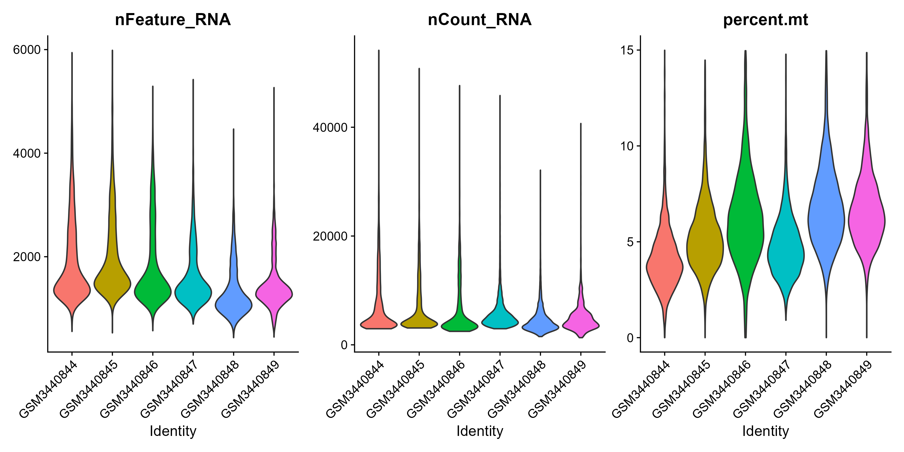
```

```{r umap-all, eval=TRUE, echo=FALSE, out.width="80%", fig.cap="图2 全细胞UMAP聚类"}
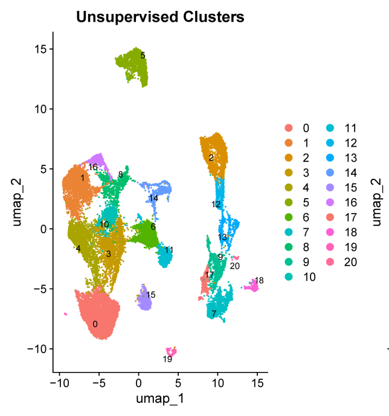
```

---

# 细胞类型注释

```{r annotation}
# 使用ACT平台注释结果导入
# 或手动设置marker基因进行注释
marker_genes <- list(
  Macrophage = c("CD68", "CD163", "MRC1"),
  T_cell     = c("CD3D", "CD3E", "CD8A"),
  B_cell     = c("CD19", "MS4A1"),
  NK_cell    = c("GNLY", "NKG7")
)
```

```{r annotation-plot, eval=TRUE, echo=FALSE, out.width="80%", fig.cap="图3 细胞类型注释UMAP"}
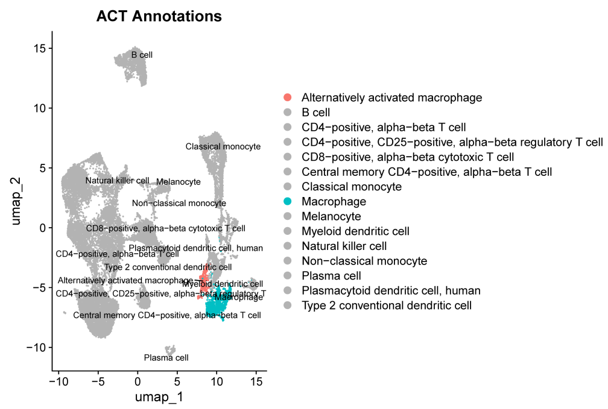
```

```{r annotation-dotplot, eval=TRUE, echo=FALSE, out.width="80%", fig.cap="图4 标记基因DotPlot"}
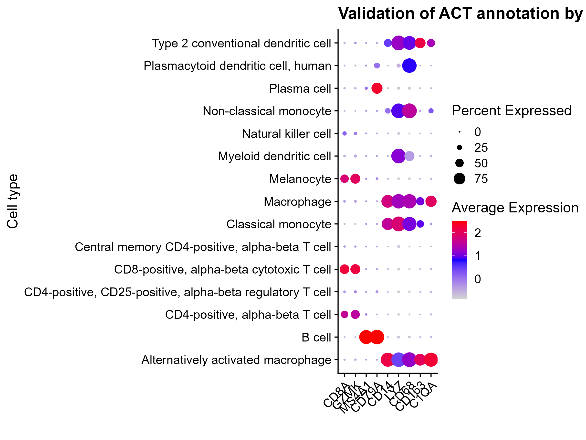
```

---

# 提取巨噬细胞

```{r extract-mac}
# 提取巨噬细胞群体
mac <- subset(sce, subset = celltype == "Macrophage")
# 共提取到1610个巨噬细胞
mac
```

---

# 巨噬细胞再聚类与剔除离群簇

```{r mac-recluster}
# 巨噬细胞单独重新降维聚类
mac <- FindVariableFeatures(mac)
mac <- ScaleData(mac)
mac <- RunPCA(mac)
mac <- RunUMAP(mac, dims = 1:15)
mac <- FindNeighbors(mac, dims = 1:15)
mac <- FindClusters(mac, resolution = 0.3)

# 剔除UMAP上空间孤立、各功能模块评分低的离群小簇（27个细胞）
# 该簇M1/M2/C1Q/SPP1/增殖评分均无显著富集，缺乏可归类的功能极化状态
mac <- subset(mac, subset = seurat_clusters != "目标cluster编号")
# 最终保留1583个巨噬细胞
```

```{r mac-umap, eval=TRUE, echo=FALSE, out.width="80%", fig.cap="图5 巨噬细胞再聚类UMAP"}
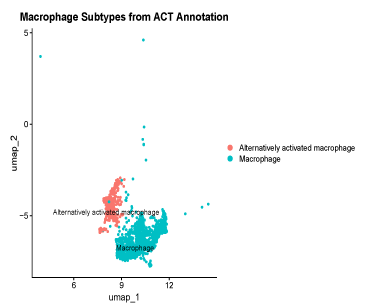
```

---

# 最终巨噬亚群注释（5个亚群）

```{r mac-annotation}
# 根据标记基因与功能评分对五个亚群进行注释
# C0: C1Q高表达，富集抗原加工提呈通路
# C1: C1Q高表达，富集淋巴细胞活化通路，免疫调节枢纽
# C2: C1Q低表达，偏向翻译代谢
# C3: C1Q最低，染色体分离相关，发育起点
# C4: 高增殖小亚群

new_labels <- c(
  "0" = "C0",
  "1" = "C1",
  "2" = "C2",
  "3" = "C3",
  "4" = "C4"
)
mac$subtype <- new_labels[as.character(mac$seurat_clusters)]
```

```{r subtype-umap, eval=TRUE, echo=FALSE, out.width="80%", fig.cap="图6 五个巨噬亚群UMAP"}
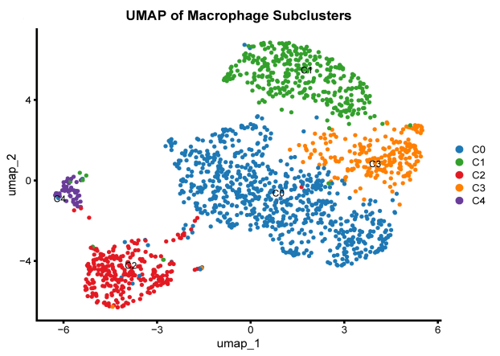
```

```{r subtype-marker, eval=TRUE, echo=FALSE, out.width="80%", fig.cap="图7 亚群标记基因热图"}
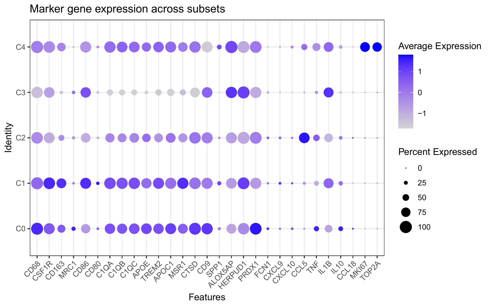
```

---

# 功能模块得分计算

```{r module-score}
library(UCell)

# 定义各功能基因集
M1_genes    <- c("TNF", "CXCL9", "IL1B", "CXCL10")
M2_genes    <- c("MRC1", "CD163", "MSR1","IL10", "TGFB1","CCL2")
C1Q_genes   <- c("C1QA", "C1QB", "C1QC","APOE")
SPP1_genes  <- c("SPP1","GPNMB","CCL18")
Prolif_genes <- c("MKI67", "TOP2A")

mac <- AddModuleScore(mac,
                      features = list(M1_genes, M2_genes,
                                      C1Q_genes, SPP1_genes, Prolif_genes),
                      name     = c("M1_score", "M2_score",
                                   "C1Q_score", "SPP1_score", "Prolif_score"))
```

```{r module-violin, eval=TRUE, echo=FALSE, out.width="80%", fig.cap="图8 各亚群功能模块得分小提琴图"}
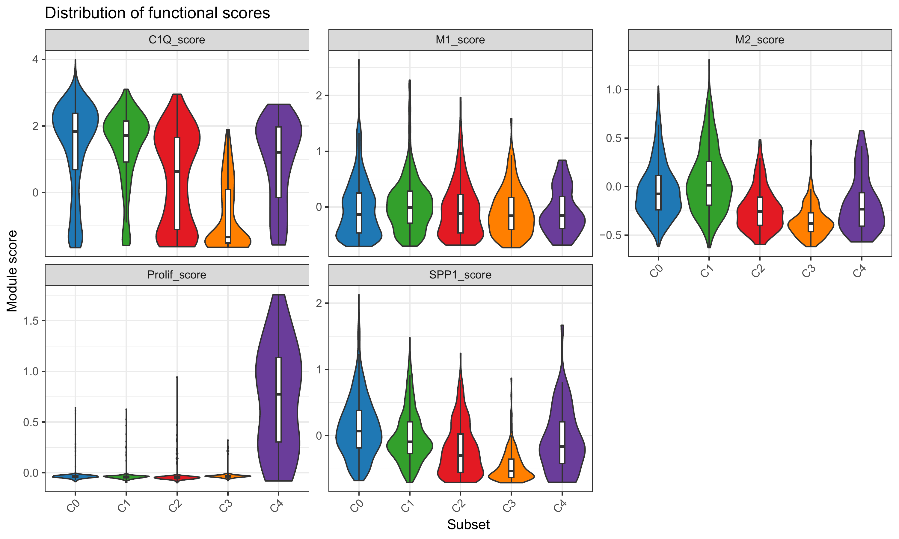
```

```{r module-umap, eval=TRUE, echo=FALSE, out.width="80%", fig.cap="图9 功能模块得分UMAP投影"}
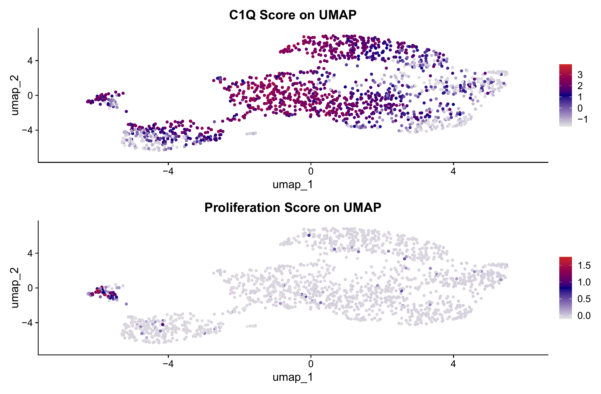
```

---

# 差异表达与GO富集分析

```{r deg}
library(clusterProfiler)
library(org.Hs.eg.db)

# 各亚群差异表达基因
mac_markers <- FindAllMarkers(mac,
                               only.pos   = TRUE,
                               min.pct    = 0.25,
                               logfc.threshold = 0.25)

# GO富集分析（以C1亚群为例）
C1_genes <- mac_markers %>%
  filter(cluster == "C1") %>%
  pull(gene)

ego <- enrichGO(gene         = C1_genes,
                OrgDb        = org.Hs.eg.db,
                keyType      = "SYMBOL",
                ont          = "BP",
                pAdjustMethod = "BH",
                pvalueCutoff  = 0.05)
```

```{r deg-heatmap, eval=TRUE, echo=FALSE, out.width="80%", fig.cap="图10 各亚群差异基因热图"}
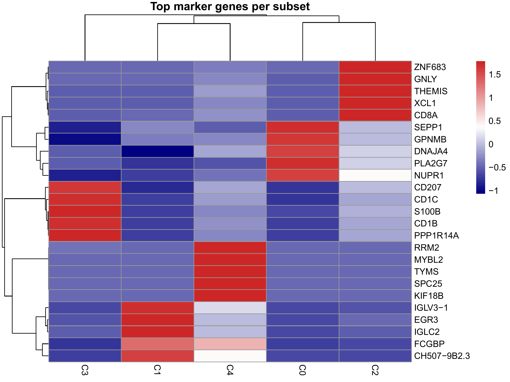
```

```{r go-plot, eval=TRUE, echo=FALSE, out.width="80%", fig.cap="图11 GO富集分析气泡图"}
knitr::include_graphics("11_go_bubble.png")
```

---

# 伪时间轨迹分析

```{r pseudotime}
library(monocle3)

# 将Seurat对象转换为CellDataSet
cds <- as.cell_data_set(mac)
cds <- cluster_cells(cds)
cds <- learn_graph(cds)

# 以C3亚群（C1Q评分最低、功能静息）为根节点
cds <- order_cells(cds, root_cells = colnames(cds[, cds$subtype == "C3"]))
```

```{r pseudotime-traj, eval=TRUE, echo=FALSE, out.width="80%", fig.cap="图12 伪时间轨迹图"}
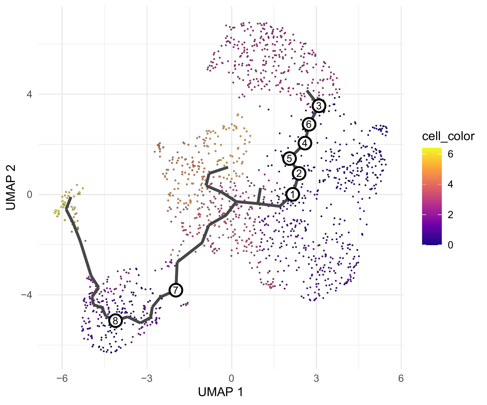
```

```{r pseudotime-c1q, eval=TRUE, echo=FALSE, out.width="80%", fig.cap="图13 C1Q评分沿伪时间的变化"}
knitr::include_graphics("13_pseudotime_c1q.png")
```

---

# CellChat细胞通讯分析

```{r cellchat}
library(CellChat)

# 创建CellChat对象
cellchat <- createCellChat(object  = mac@assays$RNA@data,
                           meta    = mac@meta.data,
                           group.by = "subtype")

# 加载人类配体受体数据库
CellChatDB <- CellChatDB.human
cellchat@DB  <- CellChatDB

# 推断细胞通讯网络
cellchat <- subsetData(cellchat)
cellchat <- identifyOverExpressedGenes(cellchat)
cellchat <- identifyOverExpressedInteractions(cellchat)
cellchat <- computeCommunProb(cellchat)
cellchat <- computeCommunProbPathway(cellchat)
cellchat <- aggregateNet(cellchat)
```

```{r cellchat-before, eval=TRUE, echo=FALSE, out.width="80%", fig.cap="图14 巨噬细胞分类前配体-受体互作热图"}
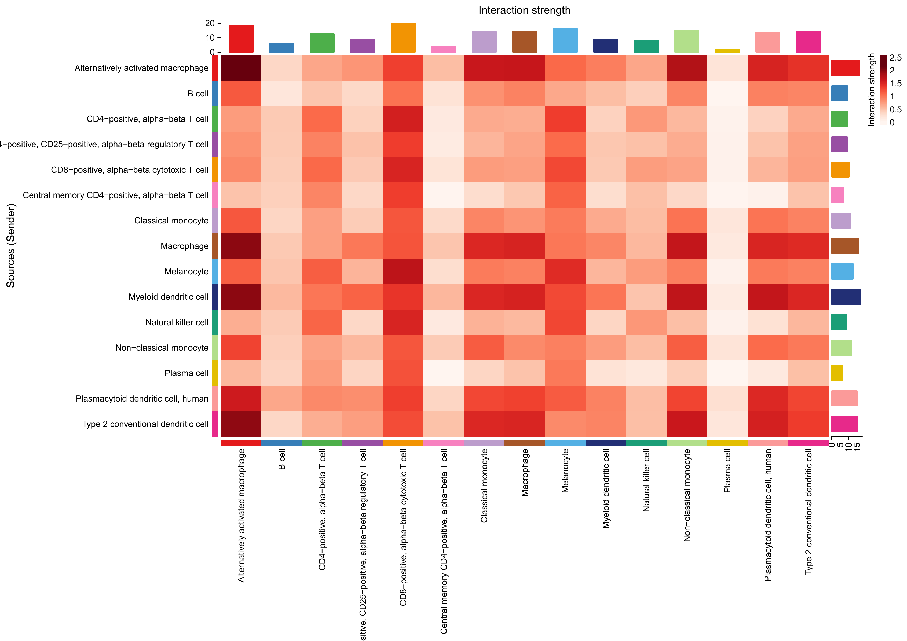
```

```{r cellchat-after, eval=TRUE, echo=FALSE, out.width="80%", fig.cap="图15 巨噬细胞分类后配体-受体互作热图"}
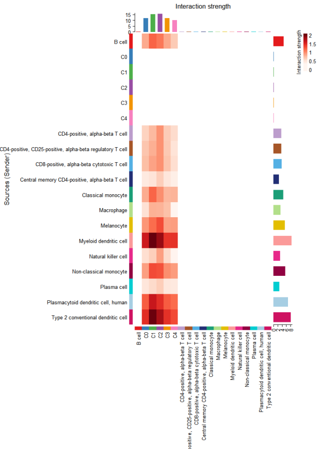
```

```{r cellchat-receptor, eval=TRUE, echo=FALSE, out.width="75%", fig.cap="图16 C1亚群相对C0上调受体（log2FC条形图）"}
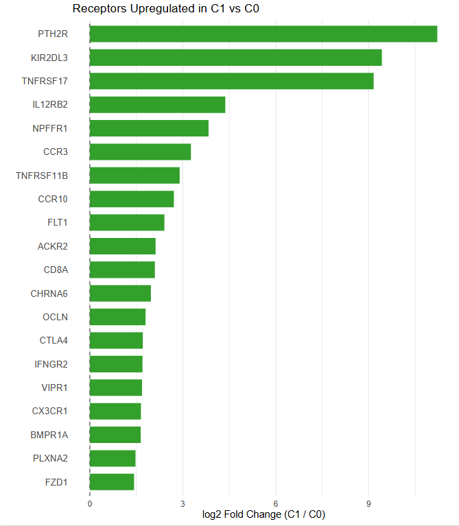
```
---

# TCGA预后与免疫浸润分析

```{r tcga}
library(survival)
library(survminer)
library(GSVA)

# 读取TCGA-KIRC表达矩阵与临床信息
tcga_expr <- read.csv("G_project_R/TCGA_KIRC_expr.csv", row.names = 1)
tcga_cli  <- read.csv("G_project_R/TCGA_KIRC_clinical.csv")

# 计算C1亚群特征基因评分
C1_signature <- mac_markers %>%
  filter(cluster == "C1", avg_log2FC > 0.5) %>%
  pull(gene)

gsva_score <- gsva(as.matrix(tcga_expr),
                   list(C1 = C1_signature),
                   method = "ssgsea")

# 生存分析
tcga_cli$C1_score <- as.numeric(gsva_score["C1", ])
tcga_cli$C1_group <- ifelse(tcga_cli$C1_score > median(tcga_cli$C1_score),
                             "High", "Low")

fit <- survfit(Surv(OS_time, OS_status) ~ C1_group, data = tcga_cli)
```

```{r km-plot, eval=TRUE, echo=FALSE, out.width="70%", fig.cap="图17 C1特征基因高低表达组KM生存曲线"}
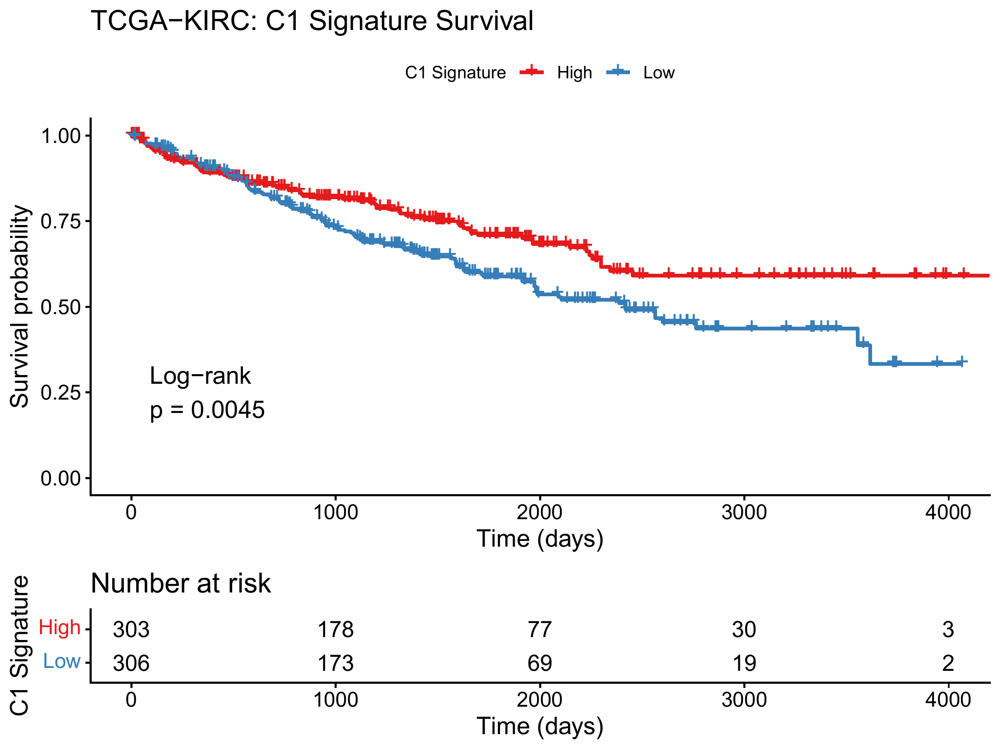
```

```{r immune-corr, eval=TRUE, echo=FALSE, out.width="80%", fig.cap="图18 C1评分与免疫细胞浸润相关性"}
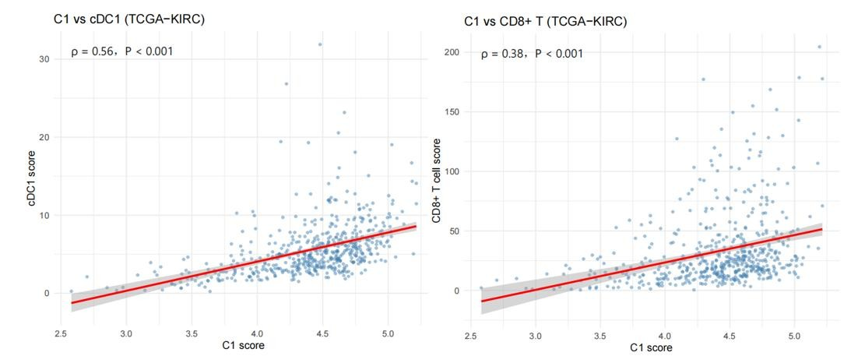
```

---

# 补充材料 {.unnumbered}

> 以下补充材料为正文分析的延伸与支撑，包括质控前原始分布、额外功能评分结果、功能富集汇总、及局限性相关分析。

---

## 补充图1 质控前原始数据分布 {.unnumbered}

```{r supp-qc-before, eval=TRUE, echo=FALSE, out.width="80%", fig.cap="补充图1 质控前各样本基因数、UMI数及线粒体比例分布"}
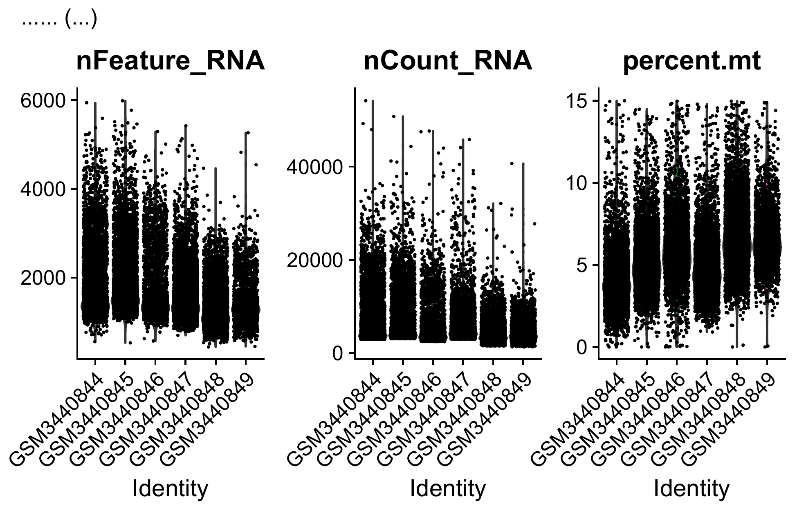
```

---

## 补充图2 五亚群功能模块得分条形图 {.unnumbered}

```{r supp-module-bar, eval=TRUE, echo=FALSE, out.width="80%", fig.cap="补充图2 各巨噬细胞亚群M1/M2/C1Q/SPP1/增殖模块平均得分条形图"}
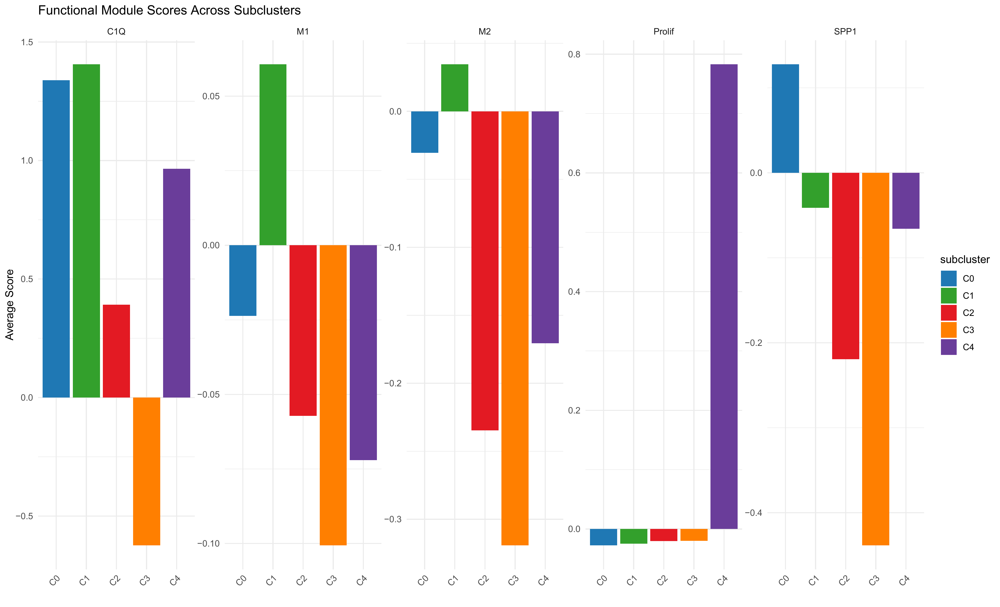
```

---

## 补充图3 C1Q模块得分高低组生存曲线 {.unnumbered}

```{r supp-km-c1q, eval=TRUE, echo=FALSE, out.width="70%", fig.cap="补充图3 TCGA-KIRC队列中C1Q模块得分高低组总生存期比较（log-rank p = 0.0045）"}
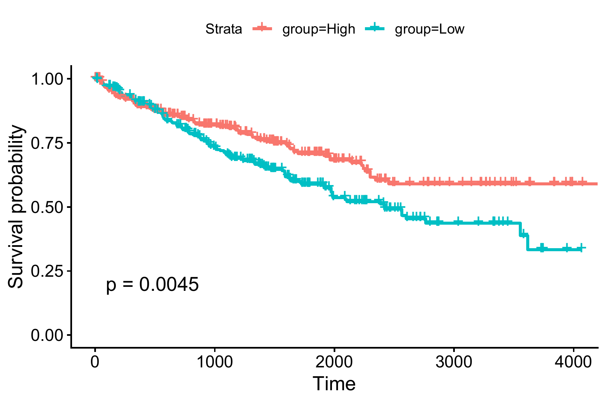
```

> 注：此处以C1Q模块得分中位数为界将患者分为高低两组，与正文图17（C1亚群特征基因评分）为独立的两种评分策略，结果方向一致，互为佐证。

---

## 补充图4 伪时间基因表达热图 {.unnumbered}

```{r supp-pseudotime-heatmap, eval=TRUE, echo=FALSE, out.width="85%", fig.cap="补充图4 沿伪时间轨迹（根节点=C3）的关键基因表达热图，示C4亚群MKI67/TOP2A显著富集"}
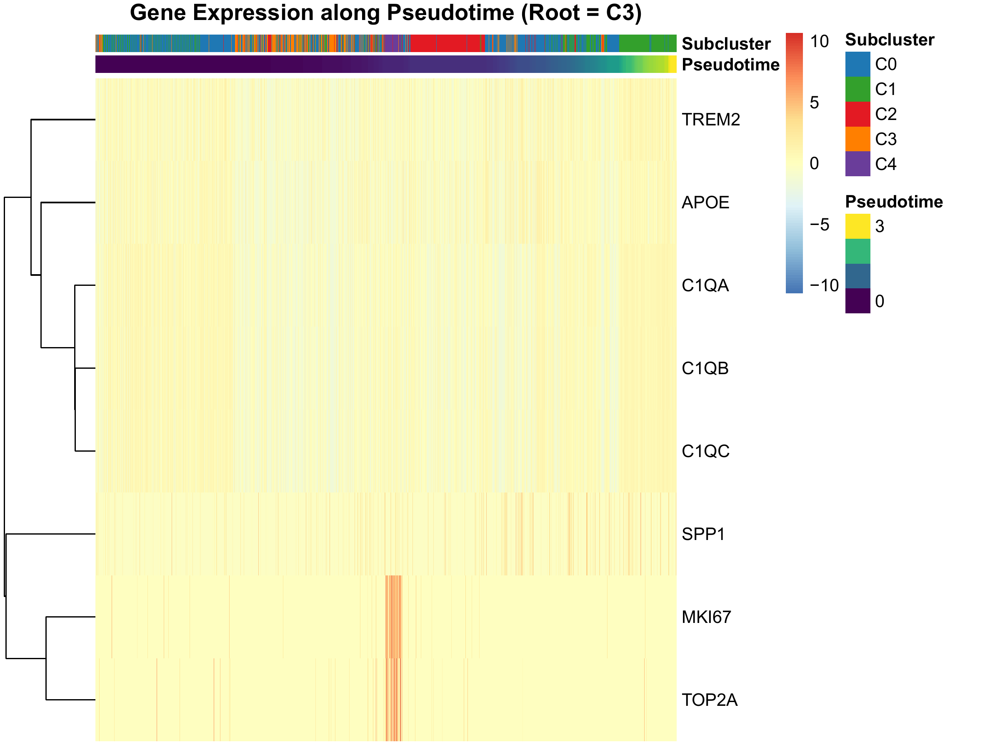
```

---

## 补充图5 C1亚群比例与免疫细胞浸润相关性 {.unnumbered}

```{r supp-immune-corr, eval=TRUE, echo=FALSE, out.width="80%", fig.cap="补充图5 C1亚群比例与各免疫细胞类型浸润的Spearman相关性"}
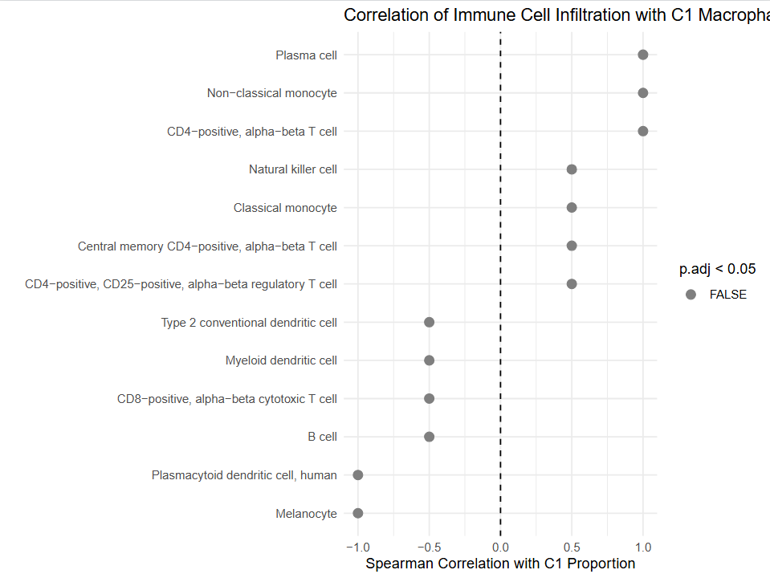
```

> 注：上述相关性在多重比较校正后均未达到统计显著性（p.adj > 0.05），提示该趋势性结果有待在更大规模队列中验证，为本研究局限性之一。

---

## 补充图6 转录因子活性热图（三分类） {.unnumbered}

```{r supp-tf, eval=TRUE, echo=FALSE, out.width="60%", fig.cap="补充图6 巨噬细胞按C1Q-TAM / M1-like / SPP1+TAM三类划分时的转录因子活性热图"}
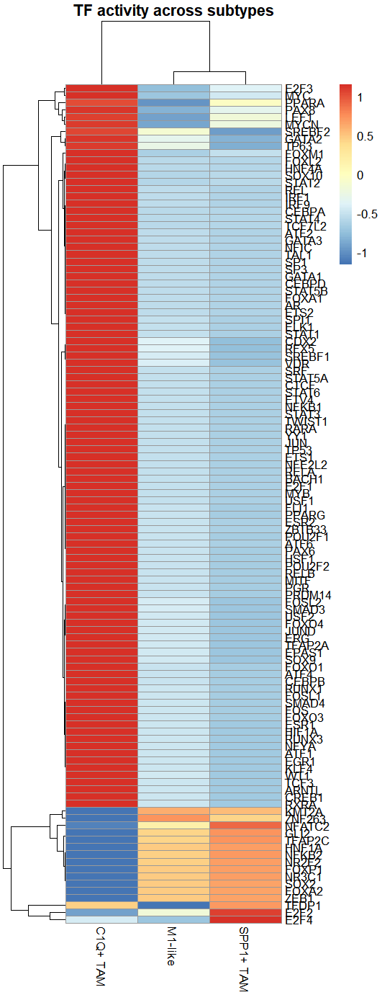
```

> 注：此图为对巨噬细胞进行粗分类（三类）时的转录因子活性分析结果，C1Q-TAM呈现出有别于M1-like及SPP1⁺TAM的独特转录因子特征，支持C1亚群作为独立功能状态的合理性。

---

## 补充表1 患者来源与亚群细胞数统计 {.unnumbered}

```{r supp-patient-table, eval=TRUE, echo=FALSE}
library(readxl)
library(knitr)
df_patient <- read_excel("supp_patient_subtype.xlsx")
kable(df_patient,
      caption = "补充表1 三例ccRCC患者各巨噬细胞亚群细胞数分布",
      align   = "c")
```

---

## 补充表2 各亚群差异表达基因Top10 {.unnumbered}

```{r supp-markers-table, eval=TRUE, echo=FALSE}
library(knitr)
markers_full <- read.table("cluster_markers_full.txt",
                            header = TRUE, sep = "\t")
# 每个亚群取Top10
top10 <- markers_full %>%
  group_by(cluster) %>%
  slice_max(order_by = avg_log2FC, n = 10) %>%
  ungroup()

kable(top10,
      caption = "补充表2 各巨噬细胞亚群差异表达基因Top10（按avg_log2FC排序）",
      digits  = 3)
```

---

## 补充附件：功能富集汇总表 {.unnumbered}

各亚群GO（BP/CC/MF）及KEGG富集分析完整结果见附件：

**`functional_enrichment_summary.pdf`**

> 该表格包含五个亚群在BP、CC、MF、KEGG四个层面的富集通路及显著性水平，共5页。

---

*分析完成。所有结果图均来自原始分析，代码仅供参考展示，不可直接重现运行。